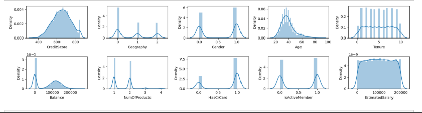
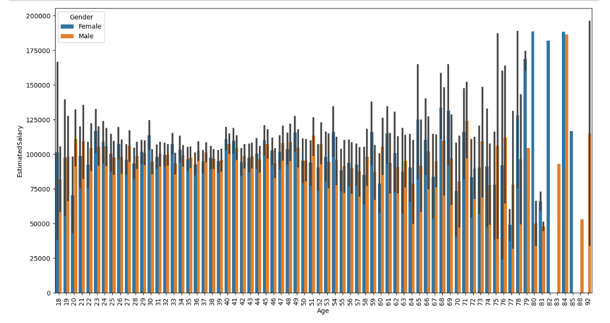
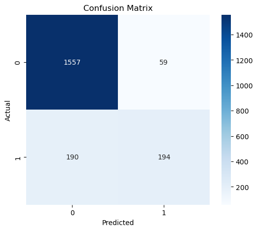

# Customer Churn Prediction

## Overview
This project focuses on predicting customer churn using machine learning techniques. The goal is to identify customers who are likely to leave a service, enabling businesses to take proactive retention measures.

---

## Dataset
The dataset contains customer-related information such as demographics, account details, and service usage.

- Total Records: ~10,000  
- Target Variable: Churn (Exited: 0 = No, 1 = Yes)

---

## Objectives
- Analyze customer behavior and identify churn patterns  
- Build classification models to predict churn  
- Evaluate model performance using multiple metrics  
- Identify key factors influencing churn  

---

## Data Preprocessing
- Handled missing values  
- Applied label encoding for categorical features  
- Removed irrelevant columns (CustomerId, Surname, etc.)  
- Split dataset into training and testing sets  

---

## Exploratory Data Analysis (EDA)
- Analyzed churn distribution across customers  
- Studied impact of Age, Active Status, and other features  
- Identified patterns influencing churn behavior  

---

## Models Used
- Logistic Regression  
- Naive Bayes  
- Decision Tree  
- Random Forest  
- K-Nearest Neighbors (KNN)  
- Support Vector Machine (SVM)  
- XGBoost  

---

## Model Evaluation
The models were evaluated using:

- Accuracy  
- Precision  
- Recall  
- F1-score  
- ROC-AUC  

---

## Results
- Achieved **87% accuracy** using Random Forest  
- Achieved strong **ROC-AUC score**, indicating good classification performance  
- Hyperparameter tuning improved model performance  
- Random Forest performed best among all models  

---

## Visualizations

### Churn Distribution

### Age vs Churn

### Active Member vs Churn

### Confusion Matrix

<!--### ROC Curve

### Model Comparison
-->

---

## Key Insights
- Customers in middle age groups show higher churn rates  
- Inactive members are more likely to churn  
- Certain customer segments have significantly higher churn probability  

---

## Technologies Used
- Python  
- Pandas, NumPy  
- Matplotlib, Seaborn  
- Scikit-learn  
- XGBoost  

---

---

## Future Improvements
- Use advanced models like LightGBM or CatBoost  
- Deploy model using Flask or FastAPI  
- Build an interactive dashboard for business insights  

---

## Conclusion
This project demonstrates a complete machine learning pipeline including data preprocessing, model building, evaluation, and insight generation. It highlights how machine learning can be used to solve real-world business problems like customer retention.

---

## Author
Tanya Roy
